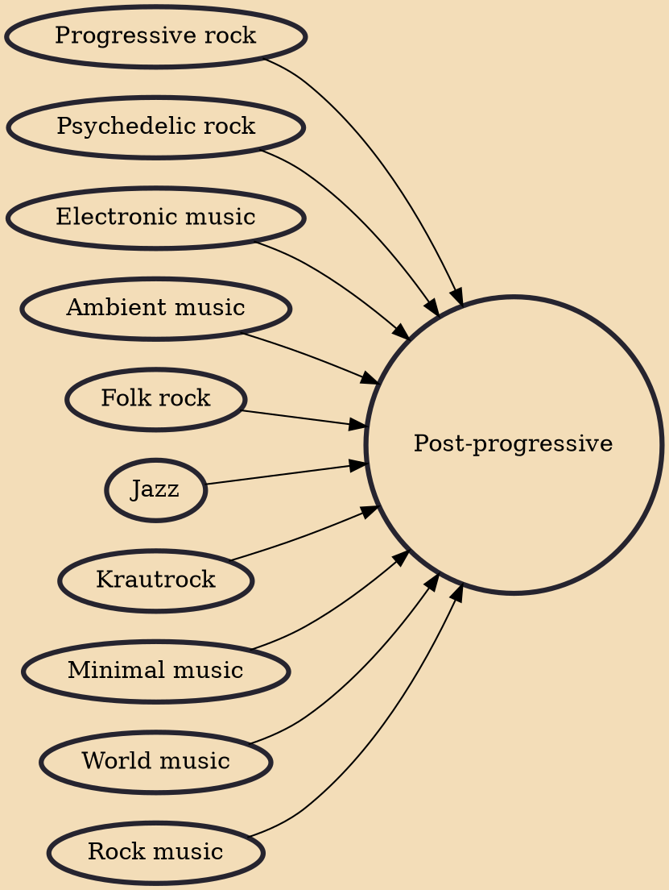

Post-progressive is a type of rock music distinguished from vintage progressive rock styles, specifically 1970s prog. Post-progressive draws upon newer developments in popular music and the avant-garde since the mid-1970s. It especially draws from ethnic music and minimalism, elements which were new to rock music. It is different from neo-progressive rock in that the latter pastiches 1970s prog, while "post-progressive" identifies progressive rock music that stems from sources other than prog.

## Influences

- [[Progressive rock]]
- [[Psychedelic rock]]
- [[Electronic music]]
- [[Ambient music]]
- [[Folk rock]]
- [[Jazz]]
- [[Krautrock]]
- [[Minimal music]]
- [[World music]]
- [[Rock music]]
