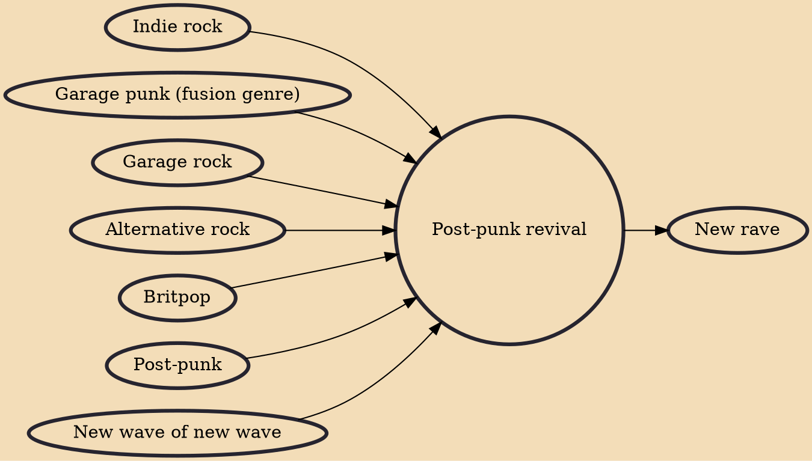

Post-punk revival (also known as garage rock revival, new wave revival, and new rock revolution) is a genre of indie rock that emerged in the early 2000s as musicians started to play a stripped down and back-to-basics version of guitar rock emerged into the mainstream. Inspired by the original sounds and aesthetics of garage rock, new wave and post-punk. The music ranged from the atonal tracks, to melodic pop songs and popularised distorted guitar sounds.

## Influences

- [[Indie rock]]
- [[Garage punk (fusion genre)]]
- [[Garage rock]]
- [[Alternative rock]]
- [[Britpop]]
- [[Post-punk]]
- [[New wave of new wave]]

## Derivatives

- [[New rave]]
