```dot
digraph {
	graph [bgcolor="#F3DDB8" rankdir=LR]
	node [color="#26242F" penwidth=3.0]
	"Post-punk" [shape=circle]
	"Punk rock" [URL="/punk-rock/"]
	"Punk rock" -> "Post-punk"
	"Electronic music" [URL="/electronic-music/"]
	"Electronic music" -> "Post-punk"
	Funk [URL="/funk/"]
	Funk -> "Post-punk"
	"Dub music" [URL="/dub-music/"]
	"Dub music" -> "Post-punk"
	"Glam rock" [URL="/glam-rock/"]
	"Glam rock" -> "Post-punk"
	Disco [URL="/disco/"]
	Disco -> "Post-punk"
	"Free jazz" [URL="/free-jazz/"]
	"Free jazz" -> "Post-punk"
	Krautrock [URL="/krautrock/"]
	Krautrock -> "Post-punk"
	"World music" [URL="/world-music/"]
	"World music" -> "Post-punk"
	"Minimal wave" [URL="/minimal-wave/"]
	"Post-punk" -> "Minimal wave"
	"Dark wave" [URL="/dark-wave/"]
	"Post-punk" -> "Dark wave"
	"Twee pop" [URL="/twee-pop/"]
	"Post-punk" -> "Twee pop"
	"Cold wave (music)" [URL="/cold-wave-music/"]
	"Post-punk" -> "Cold wave (music)"
	Shoegaze [URL="/shoegaze/"]
	"Post-punk" -> Shoegaze
	"Alternative dance" [URL="/alternative-dance/"]
	"Post-punk" -> "Alternative dance"
	"Alternative rock" [URL="/alternative-rock/"]
	"Post-punk" -> "Alternative rock"
	"Italian occult psychedelia" [URL="/italian-occult-psychedelia/"]
	"Post-punk" -> "Italian occult psychedelia"
	"Avant-funk" [URL="/avant-funk/"]
	"Post-punk" -> "Avant-funk"
	Sovietwave [URL="/sovietwave/"]
	"Post-punk" -> Sovietwave
	"Ethereal wave" [URL="/ethereal-wave/"]
	"Post-punk" -> "Ethereal wave"
	"Indie rock" [URL="/indie-rock/"]
	"Post-punk" -> "Indie rock"
	"Australian hip hop" [URL="/australian-hip-hop/"]
	"Post-punk" -> "Australian hip hop"
	"New wave of new wave" [URL="/new-wave-of-new-wave/"]
	"Post-punk" -> "New wave of new wave"
	"Electronic body music" [URL="/electronic-body-music/"]
	"Post-punk" -> "Electronic body music"
	"Indie pop" [URL="/indie-pop/"]
	"Post-punk" -> "Indie pop"
	"Paisley Underground" [URL="/paisley-underground/"]
	"Post-punk" -> "Paisley Underground"
	"Gothic rock" [URL="/gothic-rock/"]
	"Post-punk" -> "Gothic rock"
	"Neue Deutsche Welle" [URL="/neue-deutsche-welle/"]
	"Post-punk" -> "Neue Deutsche Welle"
	"Neo-psychedelia" [URL="/neo-psychedelia/"]
	"Post-punk" -> "Neo-psychedelia"
	"Dunedin sound" [URL="/dunedin-sound/"]
	"Post-punk" -> "Dunedin sound"
	"College rock" [URL="/college-rock/"]
	"Post-punk" -> "College rock"
	"Post-hardcore" [URL="/post-hardcore/"]
	"Post-punk" -> "Post-hardcore"
	"Post-rock" [URL="/post-rock/"]
	"Post-punk" -> "Post-rock"
	"Post-punk revival" [URL="/post-punk-revival/"]
	"Post-punk" -> "Post-punk revival"
	Electroclash [URL="/electroclash/"]
	"Post-punk" -> Electroclash
	"Synth-pop" [URL="/synth-pop/"]
	"Post-punk" -> "Synth-pop"
	"Dance-rock" [URL="/dance-rock/"]
	"Post-punk" -> "Dance-rock"
	"Dance-punk" [URL="/dance-punk/"]
	"Post-punk" -> "Dance-punk"
	"Noise pop" [URL="/noise-pop/"]
	"Post-punk" -> "Noise pop"
	"Könsrock" [URL="/konsrock/"]
	"Post-punk" -> "Könsrock"
	"New Pop" [URL="/new-pop/"]
	"Post-punk" -> "New Pop"
	"Gothic country" [URL="/gothic-country/"]
	"Post-punk" -> "Gothic country"
	"Industrial rock" [URL="/industrial-rock/"]
	"Post-punk" -> "Industrial rock"
	Dolewave [URL="/dolewave/"]
	"Post-punk" -> Dolewave
	"Gypsy punk" [URL="/gypsy-punk/"]
	"Post-punk" -> "Gypsy punk"
}
```

Post-punk (originally called new musick) is a broad genre of punk music that emerged in the late 1970s as musicians departed from punk's traditional elements and raw simplicity, instead adopting a variety of avant-garde sensibilities and non-rock influences. Inspired by punk's energy and DIY ethic but determined to break from rock cliches, artists experimented with styles like funk, electronic music, jazz, and dance music; the production techniques of dub and disco; and ideas from art and politics, including critical theory, modernist art, cinema and literature. These communities produced independent record labels, visual art, multimedia performances and fanzines.

## Influences

- [[Punk rock]]
- [[Electronic music]]
- [[Funk]]
- [[Dub music]]
- [[Glam rock]]
- [[Disco]]
- [[Free jazz]]
- [[Krautrock]]
- [[World music]]

## Derivatives

- [[Minimal wave]]
- [[Dark wave]]
- [[Twee pop]]
- [[Cold wave (music)]]
- [[Shoegaze]]
- [[Alternative dance]]
- [[Alternative rock]]
- [[Italian occult psychedelia]]
- [[Avant-funk]]
- [[Sovietwave]]
- [[Ethereal wave]]
- [[Indie rock]]
- [[Australian hip hop]]
- [[New wave of new wave]]
- [[Electronic body music]]
- [[Indie pop]]
- [[Paisley Underground]]
- [[Gothic rock]]
- [[Neue Deutsche Welle]]
- [[Neo-psychedelia]]
- [[Dunedin sound]]
- [[College rock]]
- [[Post-hardcore]]
- [[Post-rock]]
- [[Post-punk revival]]
- [[Electroclash]]
- [[Synth-pop]]
- [[Dance-rock]]
- [[Dance-punk]]
- [[Noise pop]]
- [[Könsrock]]
- [[New Pop]]
- [[Gothic country]]
- [[Industrial rock]]
- [[Dolewave]]
- [[Gypsy punk]]
