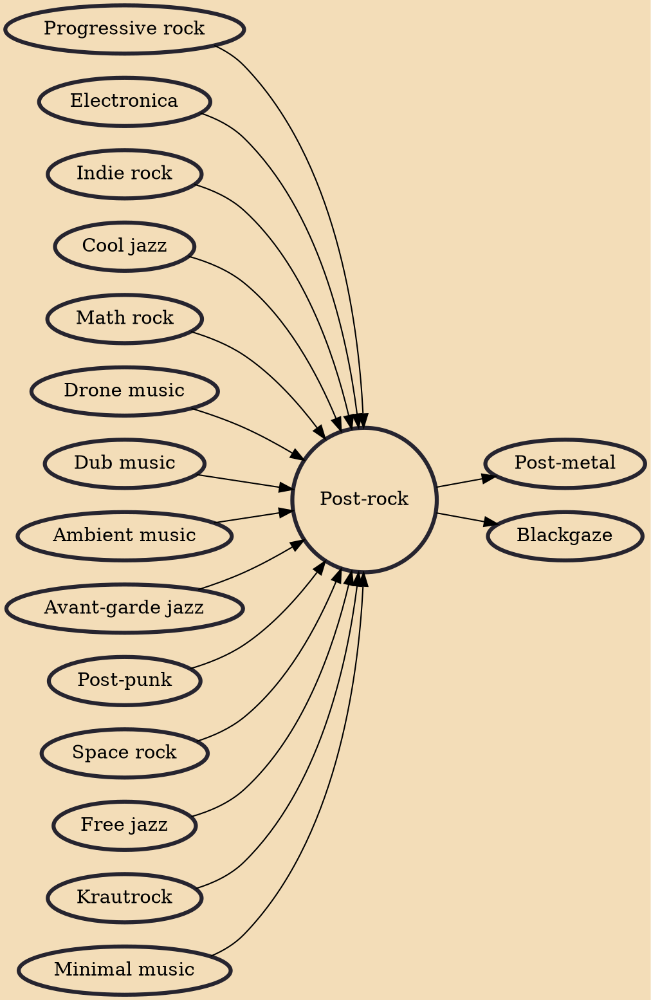

Post-rock is a form of experimental rock characterized by a focus on exploring textures and timbre over traditional rock song structures, chords, or riffs. Post-rock artists are often instrumental, typically combining rock instrumentation with electronics. The genre emerged within the indie and underground music scene of the 1980s and early 1990s. However, due to its abandonment of rock conventions, it often bears little resemblance musically to contemporary indie rock, borrowing instead from diverse sources including ambient, electronica, jazz, krautrock, dub, and minimalist classical.

## Influences

- [[Progressive rock]]
- [[Electronica]]
- [[Indie rock]]
- [[Cool jazz]]
- [[Math rock]]
- [[Drone music]]
- [[Dub music]]
- [[Ambient music]]
- [[Avant-garde jazz]]
- [[Post-punk]]
- [[Space rock]]
- [[Free jazz]]
- [[Krautrock]]
- [[Minimal music]]

## Derivatives

- [[Post-metal]]
- [[Blackgaze]]
