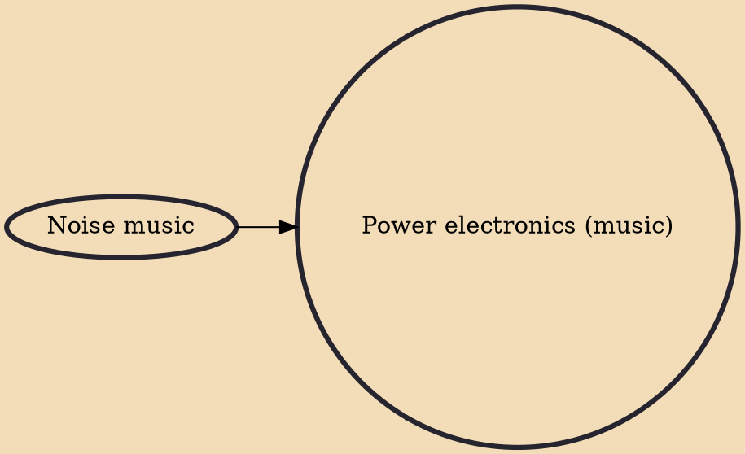

Power electronics is a style of noise music that typically consists of static, screeching waves of feedback, analogue synthesizers making sub-bass pulses or high frequency squealing sounds; with (sometimes) screamed and distorted vocals. The genre is noted for its influence from industrial.

## Influences
- [[Noise music]]
