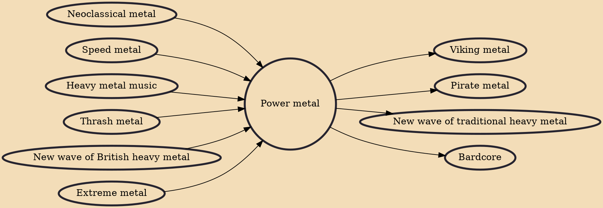

Power metal is a subgenre of heavy metal combining characteristics of traditional heavy metal with speed metal, often within symphonic context. Generally, power metal is characterized by a faster, lighter, and more uplifting sound, in contrast with the heaviness and dissonance prevalent, for example, in extreme metal. Power metal bands usually have anthem-like songs with fantasy-based subject matter and strong choruses, thus creating a theatrical, dramatic and emotionally "powerful" sound. The term was first used in the mid-1980s and refers to two different but related styles:

## Influences
- [[Neoclassical metal]]
- [[Speed metal]]
- [[Heavy metal music]]
- [[Thrash metal]]
- [[New wave of British heavy metal]]
- [[Extreme metal]]

## Derivatives
- [[Viking metal]]
- [[Pirate metal]]
- [[New wave of traditional heavy metal]]
- [[Bardcore]]
