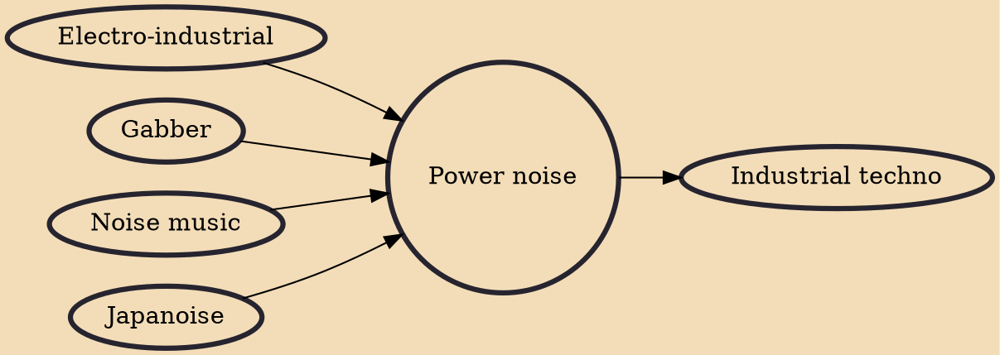

Power noise (also known as rhythmic noise and occasionally as distorted beat music) is a form of industrial music and a fusion of noise music and various styles of electronic dance music. It should not be confused with "power electronics", which is not influenced by electronic dance music and is closer to harsh noise. Its origins are predominantly European.

## Influences
- [[Electro-industrial]]
- [[Gabber]]
- [[Noise music]]
- [[Japanoise]]

## Derivatives
- [[Industrial techno]]
