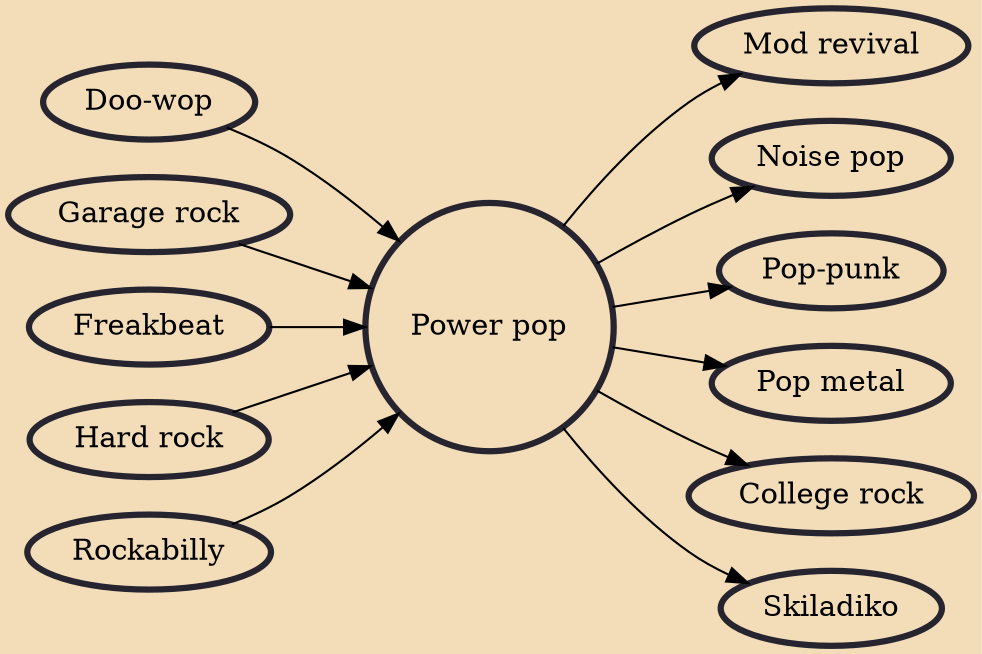

Power pop (also typeset as powerpop) is a form of pop rock based on the early music of bands such as the Who, the Beatles, the Beach Boys, and the Byrds. It typically incorporates melodic hooks, vocal harmonies, an energetic performance, and cheerful sounding music underpinned by a sense of yearning, longing, or despair. The sound is primarily rooted in pop and rock traditions of the early to mid-1960s, although some acts have occasionally drawn from later styles such as punk, new wave, glam rock, pub rock, college rock, and neo-psychedelia.

## Influences
- [[Doo-wop]]
- [[Garage rock]]
- [[Freakbeat]]
- [[Hard rock]]
- [[Rockabilly]]

## Derivatives
- [[Mod revival]]
- [[Noise pop]]
- [[Pop-punk]]
- [[Pop metal]]
- [[College rock]]
- [[Skiladiko]]
