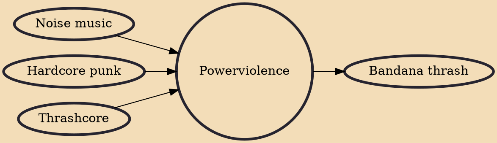

Powerviolence (sometimes written as power violence) is an extremely dissonant and fast subgenre of hardcore punk which is closely related to thrashcore and grindcore. In contrast with grindcore, which is a "crossover" idiom containing musical aspects of heavy metal, powerviolence is just an augmentation of the most challenging qualities of hardcore punk. Like its predecessors, it is usually socio-politically charged and iconoclastic.

## Influences
- [[Noise music]]
- [[Hardcore punk]]
- [[Thrashcore]]

## Derivatives
- [[Bandana thrash]]
