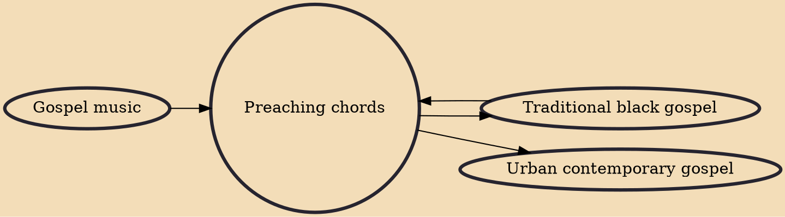

Preaching chords are blues/gospel-inspired chords played on a Hammond organ or piano, and many times with a drum set as well, near the end of a pastor or minister's sermon to accentuate, emphasize, and respond to them in a musical way. Like the related tradition of sermonic "whooping", these chords are most often used in the Black Church and Pentecostal traditions.

## Influences

- [[Gospel music]]
- [[Traditional black gospel]]

## Derivatives

- [[Traditional black gospel]]
- [[Urban contemporary gospel]]
