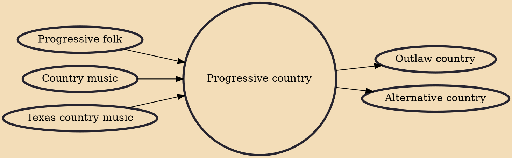

Progressive country is a subgenre of country music developed in the early 1970s.

## Influences

- [[Progressive folk]]
- [[Country music]]
- [[Texas country music]]

## Derivatives

- [[Outlaw country]]
- [[Alternative country]]
