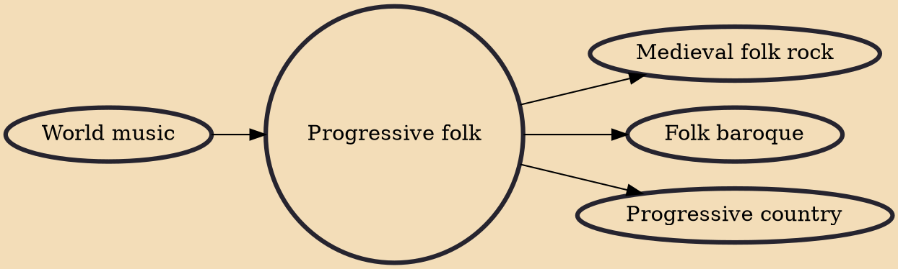

Progressive folk was originally a type of American folk music that pursued a progressive political agenda. More recently, the term has also been applied to a style of contemporary folk that draws from post-Bob Dylan folk music and adds new layers of musical and lyrical complexity, often incorporating various ethnic influences.

## Influences
- [[World music]]

## Derivatives
- [[Medieval folk rock]]
- [[Folk baroque]]
- [[Progressive country]]
