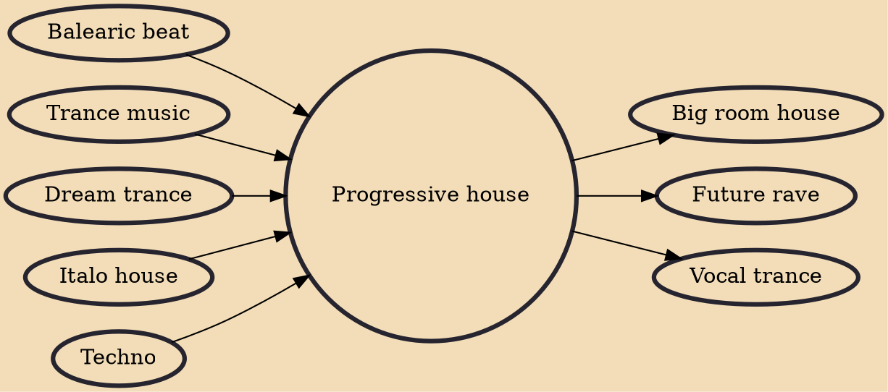

Progressive house is a subgenre of house music. The progressive house style emerged in the early 1990s. It initially developed in the United Kingdom as a natural progression of American and European house music of the late 1980s.

## Influences

- [[Balearic beat]]
- [[Trance music]]
- [[Dream trance]]
- [[Italo house]]
- [[Techno]]

## Derivatives

- [[Big room house]]
- [[Future rave]]
- [[Vocal trance]]
