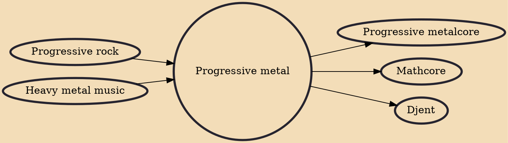

Progressive metal (sometimes shortened to prog metal) is a broad fusion music genre melding heavy metal and progressive rock, combining the loud "aggression" and amplified guitar-driven sound of the former with the more experimental, cerebral or "pseudo-classical" compositions of the latter. One of these experimental examples introduced to modern metal was djent. The music typically showcases the extreme technical proficiency of the performers and usually uses unorthodox harmonies as well as complex rhythms with frequent meter changes and intense syncopation.

## Influences
- [[Progressive rock]]
- [[Heavy metal music]]

## Derivatives
- [[Progressive metalcore]]
- [[Mathcore]]
- [[Djent]]
