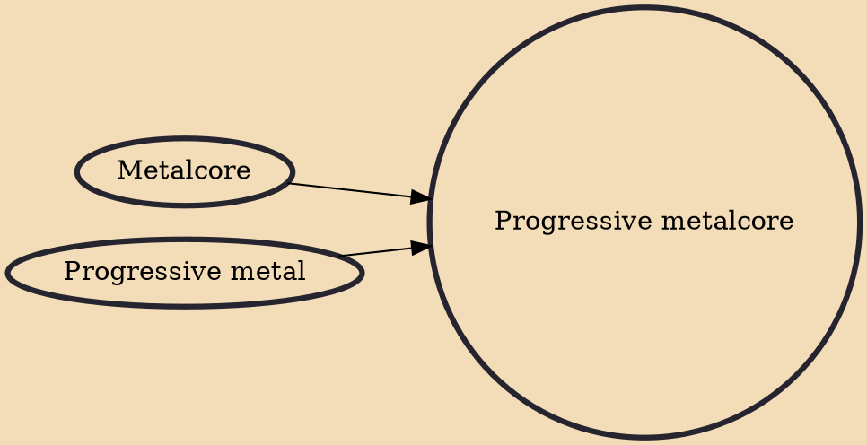

Progressive metalcore (also called technical metalcore or ambient metalcore) is a fusion of progressive metal and metalcore characterized by highly technical lead guitar, "atmospheric" elements, and complex instrumentation. Some notable practitioners take influence from djent.

## Influences

- [[Metalcore]]
- [[Progressive metal]]
