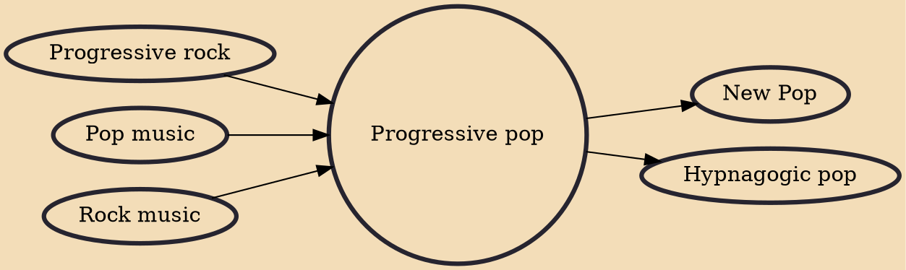

Progressive pop is pop music that attempts to break with the genre's standard formula, or an offshoot of the progressive rock genre that was commonly heard on AM radio in the 1970s and 1980s. It was originally termed for the early progressive rock of the 1960s. Some stylistic features of progressive pop include hooks and earworms, unorthodox or colorful instrumentation, changes in key and rhythm, experiments with larger forms, and unexpected, disruptive, or ironic treatments of past conventions.

## Influences

- [[Progressive rock]]
- [[Pop music]]
- [[Rock music]]

## Derivatives

- [[New Pop]]
- [[Hypnagogic pop]]
