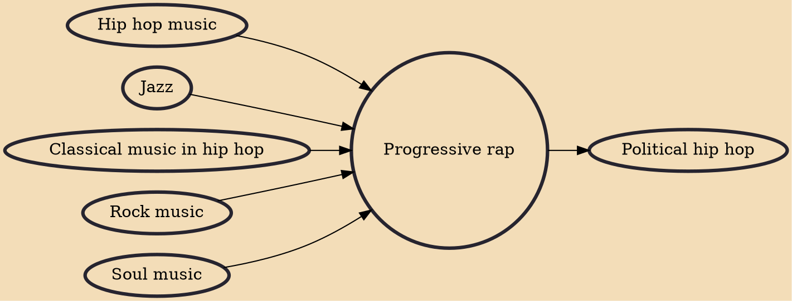

Progressive rap (or progressive hip hop) is a broad subgenre of hip hop music that aims to progress the genre thematically with socially transformative ideas and musically with stylistic experimentation. Developing through the works of innovative US hip hop acts during the 1980s and 1990s, it has also been known at various points as conscious, underground, and alternative hip hop.

## Influences

- [[Hip hop music]]
- [[Jazz]]
- [[Classical music in hip hop]]
- [[Rock music]]
- [[Soul music]]

## Derivatives

- [[Political hip hop]]
