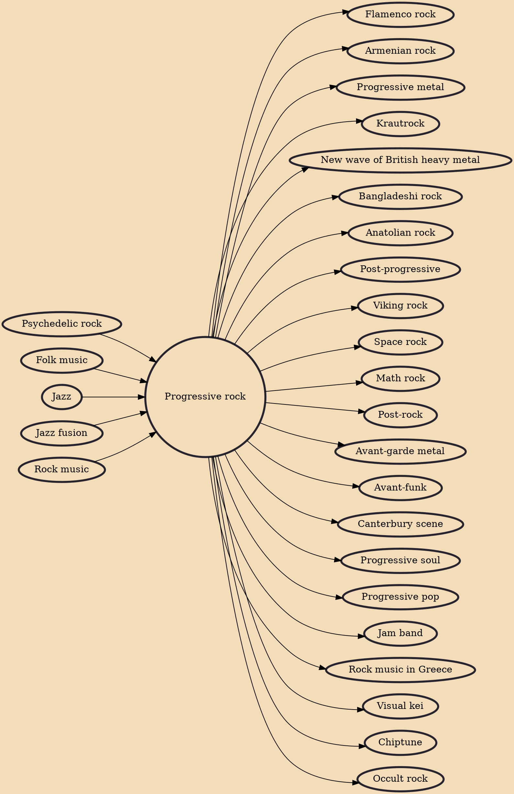

Progressive rock (shortened as prog rock or simply prog; sometimes conflated with art rock) is a broad genre of rock music that developed in the United Kingdom and United States through the mid- to late 1960s, peaking in the early 1970s. Initially termed "progressive pop", the style was an outgrowth of psychedelic bands who abandoned standard pop traditions in favour of instrumentation and compositional techniques more frequently associated with jazz, folk, or classical music. Additional elements contributed to its "progressive" label: lyrics were more poetic, technology was harnessed for new sounds, music approached the condition of "art", and the studio, rather than the stage, became the focus of musical activity, which often involved creating music for listening rather than dancing.

## Influences
- [[Psychedelic rock]]
- [[Folk music]]
- [[Jazz]]
- [[Jazz fusion]]
- [[Rock music]]

## Derivatives
- [[Flamenco rock]]
- [[Armenian rock]]
- [[Progressive metal]]
- [[Krautrock]]
- [[New wave of British heavy metal]]
- [[Bangladeshi rock]]
- [[Anatolian rock]]
- [[Post-progressive]]
- [[Viking rock]]
- [[Space rock]]
- [[Math rock]]
- [[Post-rock]]
- [[Avant-garde metal]]
- [[Avant-funk]]
- [[Canterbury scene]]
- [[Progressive soul]]
- [[Progressive pop]]
- [[Jam band]]
- [[Rock music in Greece]]
- [[Visual kei]]
- [[Chiptune]]
- [[Occult rock]]
