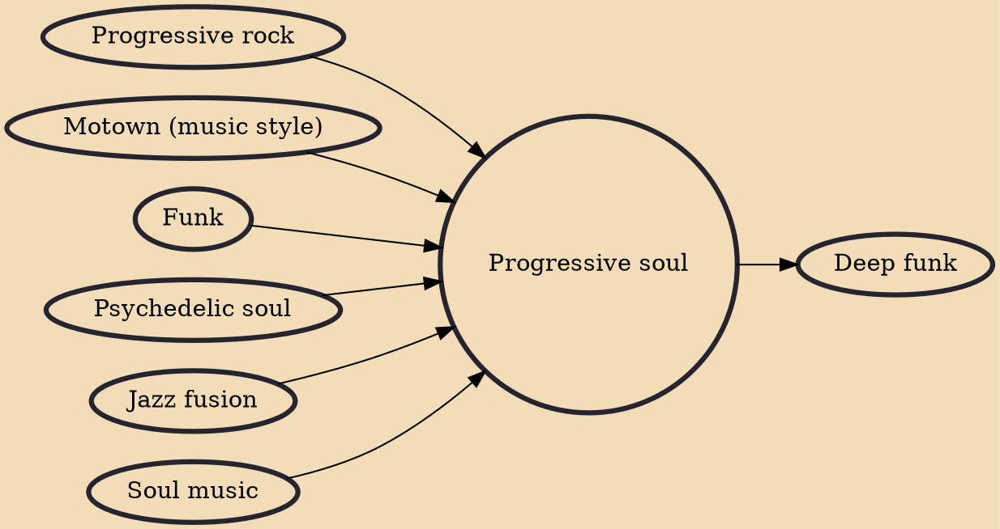

Progressive soul (often shortened to prog-soul; also called black prog, black rock, and progressive R&B) is a type of African-American music that uses a progressive approach, particularly in the context of the soul and funk genres. It developed in the late 1960s and early 1970s through the recordings of innovative black musicians who pushed the structural and stylistic boundaries of those genres. Among their influences were musical forms that arose from rhythm and blues music's transformation into rock, such as Motown, progressive rock, psychedelic soul, and jazz fusion.

## Influences

- [[Progressive rock]]
- [[Motown (music style)]]
- [[Funk]]
- [[Psychedelic soul]]
- [[Jazz fusion]]
- [[Soul music]]

## Derivatives

- [[Deep funk]]
