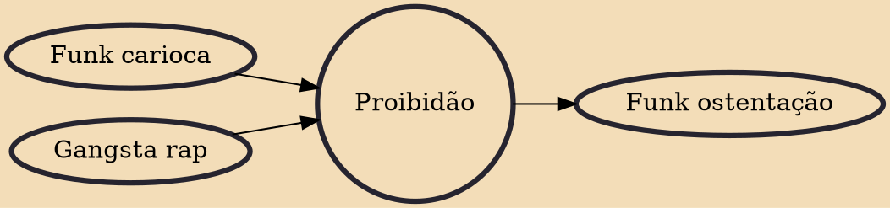

Proibidão, which literally translates to "strongly prohibited", is a subgenre of funk carioca music originating from the favelas of Rio de Janeiro where it began in the early 1990s as a parallel phenomenon to the growth of drug gangs in the many slums of the city. The drug gangs sponsored DJs and baile funks in the favelas they controlled to spread respect and love for their gang as well as hate to the other gangs. The music that resulted is proibidão.

## Influences
- [[Funk carioca]]
- [[Gangsta rap]]

## Derivatives
- [[Funk ostentação]]
