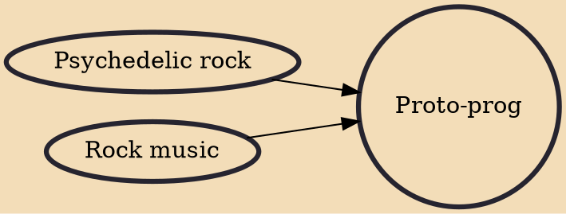

Proto-prog (short for proto-progressive) is the earliest work associated with the first wave of progressive rock music, known then as "progressive pop". Such musicians were influenced by modern classical and other genres usually outside of traditional rock influences. They often employed longer and more complicated compositions, interconnected songs as medley, and studio composition. Some of the artists that were essential to the development of progressive rock, rather than just anticipating the movement, include the Beatles, the Beach Boys, the Doors, the Pretty Things, the Zombies, the Byrds, the Grateful Dead and Pink Floyd.

## Influences
- [[Psychedelic rock]]
- [[Rock music]]
