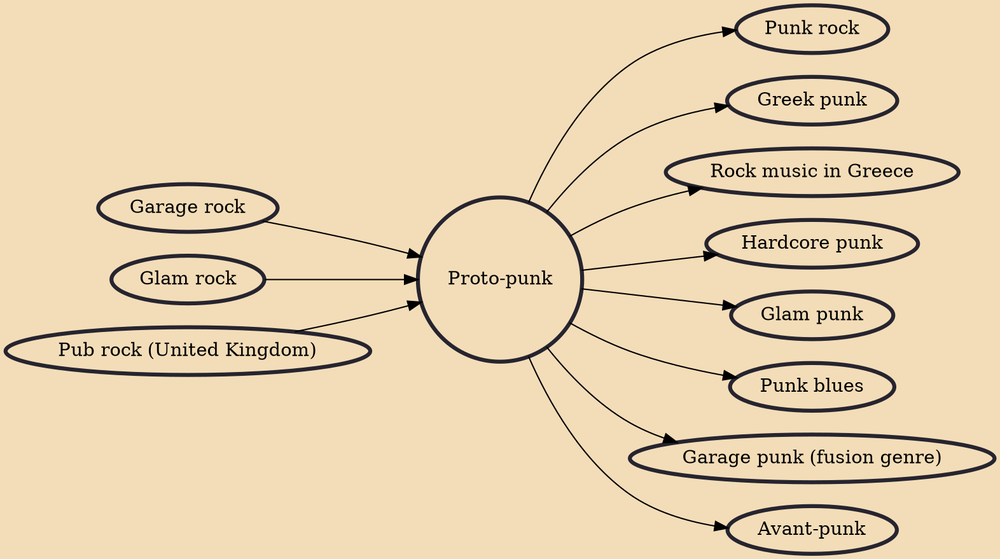

Proto-punk (or protopunk) is rock music played mostly by garage bands from the 1960s to mid-1970s that foreshadowed the punk rock movement. The phrase is a retrospective label; the musicians involved were generally not originally associated with each other and came from a variety of backgrounds and styles; together, they anticipated many of punk's musical and thematic attributes.

## Influences
- [[Garage rock]]
- [[Glam rock]]
- [[Pub rock (United Kingdom)]]

## Derivatives
- [[Punk rock]]
- [[Greek punk]]
- [[Rock music in Greece]]
- [[Hardcore punk]]
- [[Glam punk]]
- [[Punk blues]]
- [[Garage punk (fusion genre)]]
- [[Avant-punk]]
