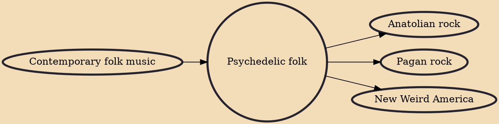

Psychedelic folk (sometimes acid folk or freak folk) is a loosely defined form of psychedelia that originated in the 1960s. It retains the largely acoustic instrumentation of folk, but adds musical elements common to psychedelic music.

## Influences

- [[Contemporary folk music]]

## Derivatives

- [[Anatolian rock]]
- [[Pagan rock]]
- [[New Weird America]]
