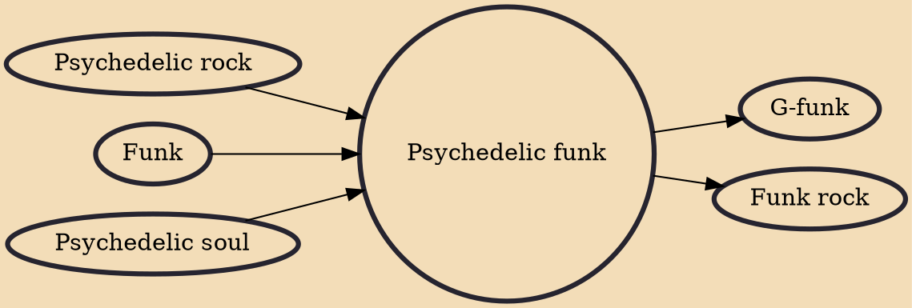

Psychedelic funk (also called P-funk or funkadelia, and sometimes conflated with psychedelic soul) is a music genre that combines funk music with elements of psychedelic rock. It was pioneered in the late 1960s and early 1970s by American acts like Sly and the Family Stone, Jimi Hendrix, and the Parliament-Funkadelic collective. It would influence subsequent styles including '70s jazz fusion and the '90s West Coast hip hop style G-funk.

## Influences
- [[Psychedelic rock]]
- [[Funk]]
- [[Psychedelic soul]]

## Derivatives
- [[G-funk]]
- [[Funk rock]]
