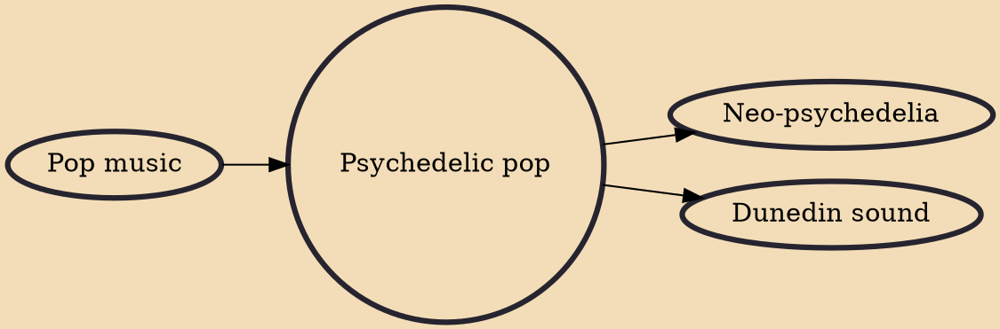

Psychedelic pop (or acid pop) is pop music that contains musical characteristics associated with psychedelic music. Developing in the late 1960s, elements included "trippy" features such as fuzz guitars, tape manipulation, backwards recording, sitars, and Beach Boys-style harmonies, wedded to melodic songs with tight song structures. The style lasted into the early 1970s. It has seen revivals in subsequent decades by neo-psychedelic artists.

## Influences

- [[Pop music]]

## Derivatives

- [[Neo-psychedelia]]
- [[Dunedin sound]]
