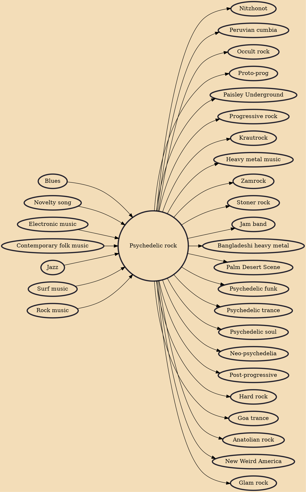

Psychedelic rock is a rock music genre that is inspired, influenced, or representative of psychedelic culture, which is centered on perception-altering hallucinogenic drugs. The music incorporated new electronic sound effects and recording techniques, extended instrumental solos, and improvisation. Many psychedelic groups differ in style, and the label is often applied spuriously.

## Influences

- [[Blues]]
- [[Novelty song]]
- [[Electronic music]]
- [[Contemporary folk music]]
- [[Jazz]]
- [[Surf music]]
- [[Rock music]]

## Derivatives

- [[Nitzhonot]]
- [[Peruvian cumbia]]
- [[Occult rock]]
- [[Proto-prog]]
- [[Paisley Underground]]
- [[Progressive rock]]
- [[Krautrock]]
- [[Heavy metal music]]
- [[Zamrock]]
- [[Stoner rock]]
- [[Jam band]]
- [[Bangladeshi heavy metal]]
- [[Palm Desert Scene]]
- [[Psychedelic funk]]
- [[Psychedelic trance]]
- [[Psychedelic soul]]
- [[Neo-psychedelia]]
- [[Post-progressive]]
- [[Hard rock]]
- [[Goa trance]]
- [[Anatolian rock]]
- [[New Weird America]]
- [[Glam rock]]
