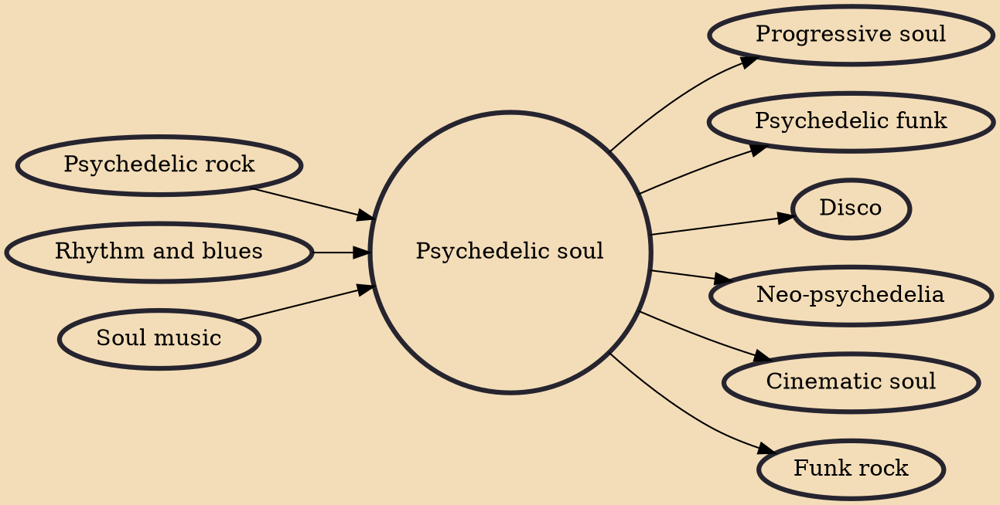

Psychedelic soul (originally called black rock or conflated with psychedelic funk) is a music genre that emerged in the late 1960s and saw Black soul musicians embrace elements of psychedelic rock, including its production techniques, instrumentation, effects units (wah-wah pedal, phaser, etc.) and drug influences. It came to prominence in the late 1960s and continued into the 1970s, playing a major role in the development of funk and disco.

## Influences
- [[Psychedelic rock]]
- [[Rhythm and blues]]
- [[Soul music]]

## Derivatives
- [[Progressive soul]]
- [[Psychedelic funk]]
- [[Disco]]
- [[Neo-psychedelia]]
- [[Cinematic soul]]
- [[Funk rock]]
