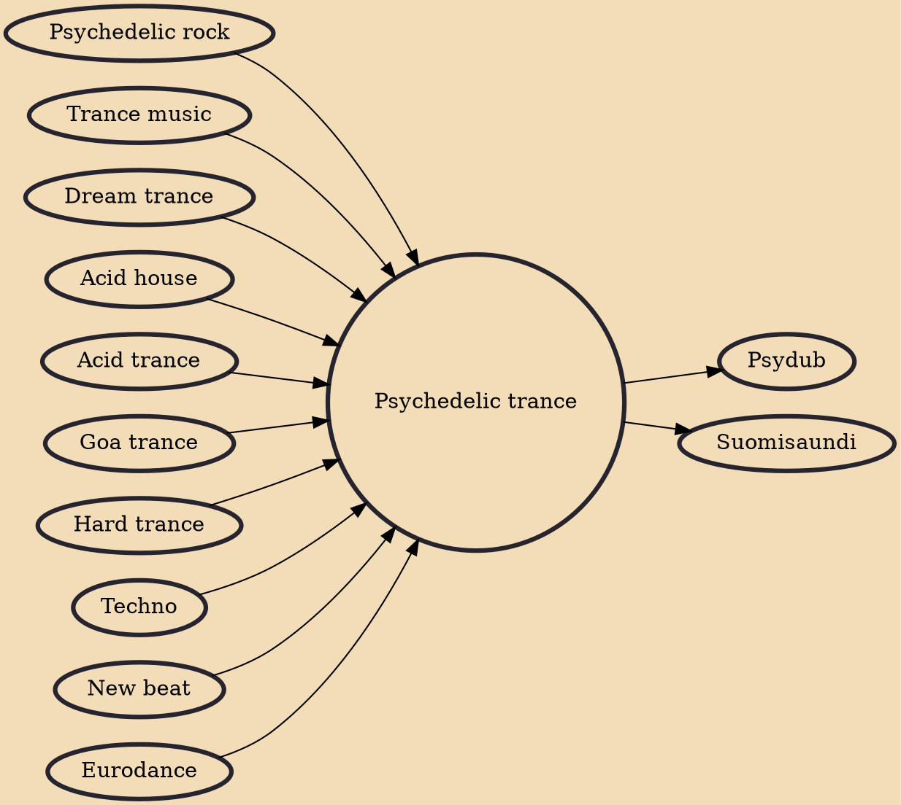

Psychedelic Trance, Psytrance or Psy is a subgenre of trance music characterized by arrangements of rhythms and layered melodies created by high tempo riffs. The genre offers variety in terms of mood, tempo, and style. Some examples include full on, darkpsy, forest, minimal (Zenonesque), hitech psy, , suomi, psy-chill, psycore (fusion of psychedelic trance and hardcore), psybient (fusion of psychedelic trance and ambient), psybreaks, or "adapted" tracks from other music genres. Goa trance preceded psytrance; when digital media became more commonly used psytrance evolved. Goa continues to develop alongside the other genres.

## Influences

- [[Psychedelic rock]]
- [[Trance music]]
- [[Dream trance]]
- [[Acid house]]
- [[Acid trance]]
- [[Goa trance]]
- [[Hard trance]]
- [[Techno]]
- [[New beat]]
- [[Eurodance]]

## Derivatives

- [[Psydub]]
- [[Suomisaundi]]
