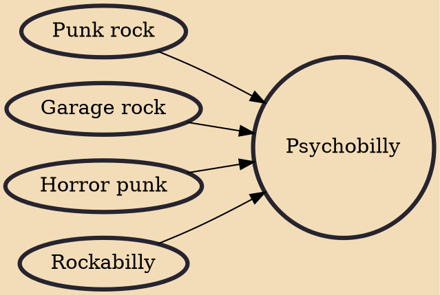

Psychobilly is a rock music fusion genre that fuses elements of rockabilly and punk rock. It's been defined as "loud frantic rockabilly music", it has also been said that it "takes the traditional countrified rock style known as rockabilly, ramp[ing] up its speed to a sweaty pace, and combin[ing] it with punk rock and imagery lifted from horror films and late-night sci-fi schlock,... [creating a] gritty honky tonk punk rock."

## Influences

- [[Punk rock]]
- [[Garage rock]]
- [[Horror punk]]
- [[Rockabilly]]
