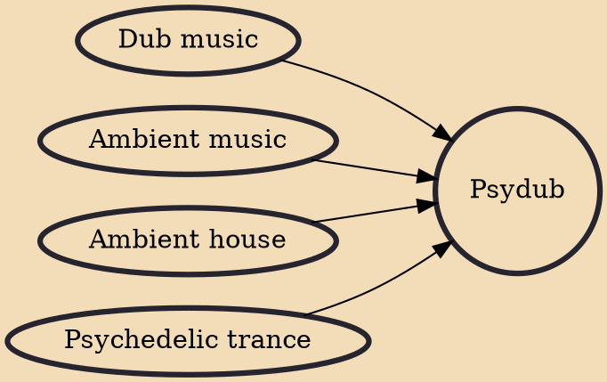

Psydub (or sometimes inaccurately ambient dub) is a fusion genre of electronic music that has its roots in psychedelic trance, ambient and dub music.Incorporated dub elements are melodic basslines, deep reggae roots and producing techniques like dynamically adding extensive echo, reverb, panoramic delay, and occasional dubbing of vocal or instrumental snippets from the original version or other works.An incorporated ambient element is an emphasis on tone and atmosphere.Incorporated psytrance elements are low-bass frequencies and hypnotic melodies and the use of samples. Those samples mostly contain references to drugs, parapsychology, extraterrestrial life, existentialism, out of body experiences, dreams, science, time travel, spirituality and similar mysterious or unconventional topics.Ps

## Influences

- [[Dub music]]
- [[Ambient music]]
- [[Ambient house]]
- [[Psychedelic trance]]
