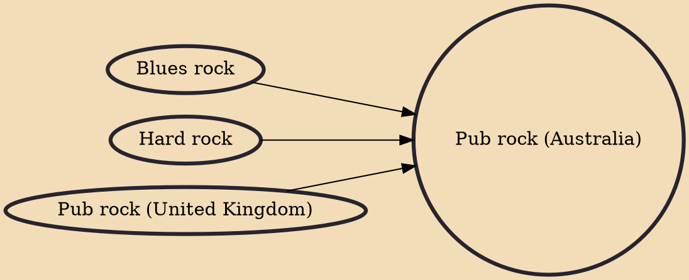

Pub rock is a style of Australian rock and roll popular throughout the 1970s and 1980s, and that was still influencing contemporary Australian music in the 2000s. The term came from the venues where most of these bands originally played — inner-city and suburban pubs. These often noisy, hot, small and crowded venues were not always ideal as music venues and favoured loud, simple songs based on drums and electric guitar riffs.

## Influences

- [[Blues rock]]
- [[Hard rock]]
- [[Pub rock (United Kingdom)]]
