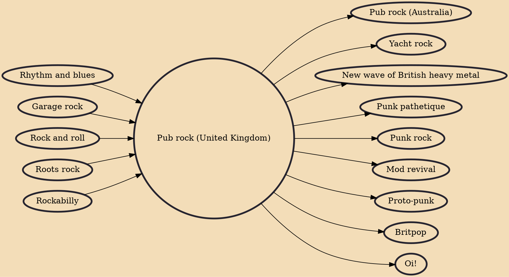

Pub rock is a rock music genre that was developed in the early to mid-1970s in the United Kingdom. A back-to-basics movement which incorporated roots rock, pub rock was a reaction against the expensively-recorded and produced progressive rock and flashy glam rock scenes of the time. Although short-lived, pub rock was live rock played in small traditional venues like pubs and clubs. Since major labels showed no interest in pub rock groups, pub rockers sought out independent record labels such as Stiff Records. Indie labels used relatively inexpensive recording processes, so they had a much lower break-even point for a record than a major label.

## Influences
- [[Rhythm and blues]]
- [[Garage rock]]
- [[Rock and roll]]
- [[Roots rock]]
- [[Rockabilly]]

## Derivatives
- [[Pub rock (Australia)]]
- [[Yacht rock]]
- [[New wave of British heavy metal]]
- [[Punk pathetique]]
- [[Punk rock]]
- [[Mod revival]]
- [[Proto-punk]]
- [[Britpop]]
- [[Oi!]]
