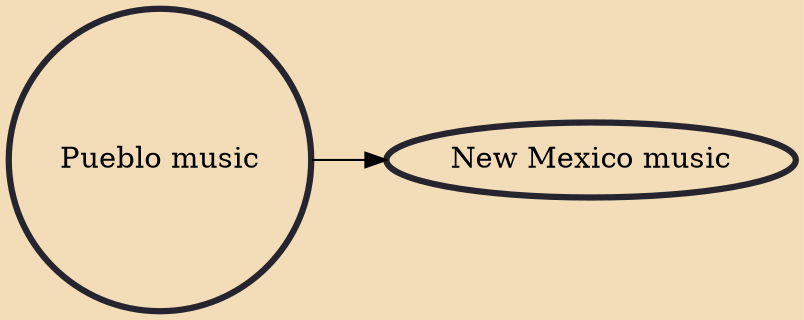

Pueblo music includes the music of the Hopi, Zuni, Taos Pueblo, San Ildefonso, Santo Domingo, and many other Puebloan peoples, and according to Bruno Nettl features one of the most complex Native American musical styles on the continent. Characteristics include common use of hexatonic and heptatonic scales, variety of form, melodic contour, and percussive accompaniment, melodic range averaging between an octave and a twelfth, with rhythmic complexity equal to the Plains Indians musical sub-area.

## Derivatives
- [[New Mexico music]]
