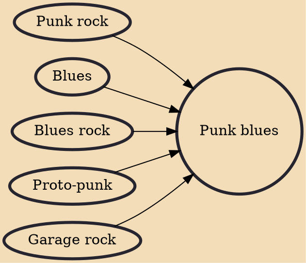

Punk blues (or blues punk) is a rock music genre that mixes elements of punk rock and blues. Punk blues musicians and bands usually incorporate elements of related styles, such as protopunk and blues rock. Its origins lie strongly within the garage rock sound of the 1960s and 1970s. Punk blues can be said to favor the common rawness, simplicity and emotion shared between the punk and blues genres. Chet Weise, singer/guitarist of the Immortal Lee County Killers stated, "Punk and blues are both honest reactions to life. It's blues, it's our blues. It's just a bit turned up and a bit faster."

## Influences

- [[Punk rock]]
- [[Blues]]
- [[Blues rock]]
- [[Proto-punk]]
- [[Garage rock]]
