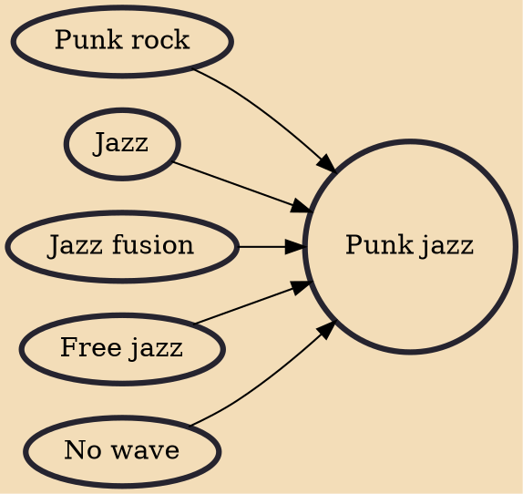

Punk jazz is a genre of music that combines elements of jazz, especially improvisation, with the instrumentation and performance style of punk rock. The term was first used to describe James Chance and the Contortions' 1979 album Buy. Punk jazz is closely related to free jazz, no wave, and loft jazz, and has since significantly inspired post-hardcore and alternative hip hop. Notable proponents of the genre include John Zorn, Arto Lindsay, Elliott Sharp, and James Chance, among others.

## Influences

- [[Punk rock]]
- [[Jazz]]
- [[Jazz fusion]]
- [[Free jazz]]
- [[No wave]]
