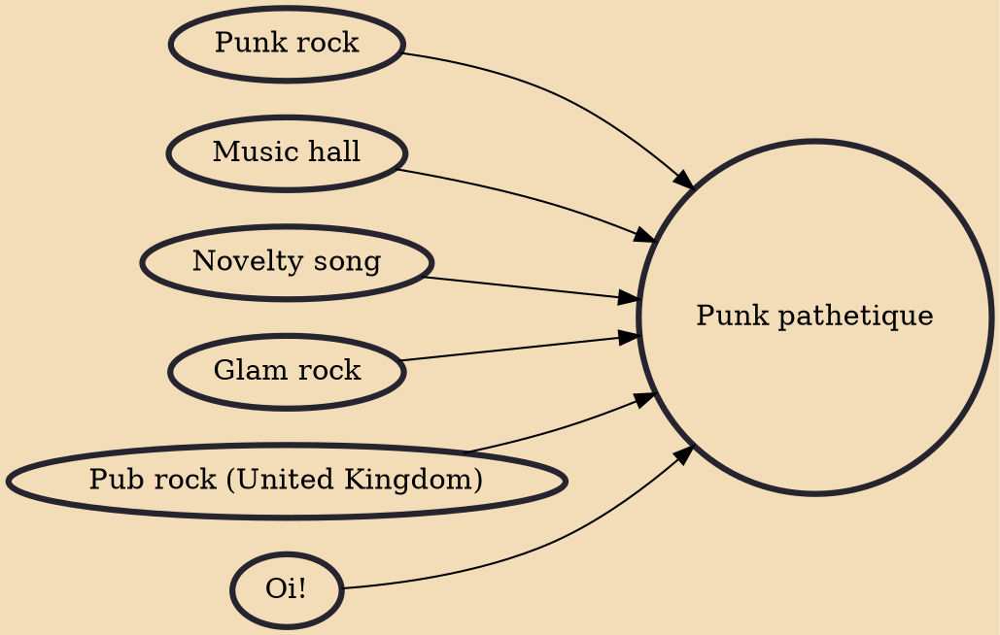

Punk pathetique is a subgenre of British punk rock (principally active circa 1980–1982) that involved humour and working-class cultural themes.

## Influences

- [[Punk rock]]
- [[Music hall]]
- [[Novelty song]]
- [[Glam rock]]
- [[Pub rock (United Kingdom)]]
- [[Oi!]]
