```dot
digraph {
	graph [bgcolor="#F3DDB8" rankdir=LR]
	node [color="#26242F" penwidth=3.0]
	"Punk rock" [shape=circle]
	"Proto-punk" [URL="/proto-punk/"]
	"Proto-punk" -> "Punk rock"
	"Garage rock" [URL="/garage-rock/"]
	"Garage rock" -> "Punk rock"
	"Bubblegum music" [URL="/bubblegum-music/"]
	"Bubblegum music" -> "Punk rock"
	"Glam punk" [URL="/glam-punk/"]
	"Glam punk" -> "Punk rock"
	"Glam rock" [URL="/glam-rock/"]
	"Glam rock" -> "Punk rock"
	"Hard rock" [URL="/hard-rock/"]
	"Hard rock" -> "Punk rock"
	"Pub rock (United Kingdom)" [URL="/pub-rock-united-kingdom/"]
	"Pub rock (United Kingdom)" -> "Punk rock"
	"Surf music" [URL="/surf-music/"]
	"Surf music" -> "Punk rock"
	"Rock and roll" [URL="/rock-and-roll/"]
	"Rock and roll" -> "Punk rock"
	Rockabilly [URL="/rockabilly/"]
	Rockabilly -> "Punk rock"
	Cowpunk [URL="/cowpunk/"]
	"Punk rock" -> Cowpunk
	"Nagoya kei" [URL="/nagoya-kei/"]
	"Punk rock" -> "Nagoya kei"
	Grunge [URL="/grunge/"]
	"Punk rock" -> Grunge
	"Two-tone (music genre)" [URL="/two-tone-music-genre/"]
	"Punk rock" -> "Two-tone (music genre)"
	Emo [URL="/emo/"]
	"Punk rock" -> Emo
	"Celtic punk" [URL="/celtic-punk/"]
	"Punk rock" -> "Celtic punk"
	"Nazi punk" [URL="/nazi-punk/"]
	"Punk rock" -> "Nazi punk"
	"Street punk" [URL="/street-punk/"]
	"Punk rock" -> "Street punk"
	"New wave of British heavy metal" [URL="/new-wave-of-british-heavy-metal/"]
	"Punk rock" -> "New wave of British heavy metal"
	"Shock rock" [URL="/shock-rock/"]
	"Punk rock" -> "Shock rock"
	"Avant-punk" [URL="/avant-punk/"]
	"Punk rock" -> "Avant-punk"
	"Gypsy punk" [URL="/gypsy-punk/"]
	"Punk rock" -> "Gypsy punk"
	"Bay Area thrash metal" [URL="/bay-area-thrash-metal/"]
	"Punk rock" -> "Bay Area thrash metal"
	"Avant-funk" [URL="/avant-funk/"]
	"Punk rock" -> "Avant-funk"
	"Dance-punk" [URL="/dance-punk/"]
	"Punk rock" -> "Dance-punk"
	"Oi!" [URL="/oi/"]
	"Punk rock" -> "Oi!"
	"Garage punk (fusion genre)" [URL="/garage-punk-fusion-genre/"]
	"Punk rock" -> "Garage punk (fusion genre)"
	"Folk punk" [URL="/folk-punk/"]
	"Punk rock" -> "Folk punk"
	"Hardcore punk" [URL="/hardcore-punk/"]
	"Punk rock" -> "Hardcore punk"
	"Gothic rock" [URL="/gothic-rock/"]
	"Punk rock" -> "Gothic rock"
	"Indie pop" [URL="/indie-pop/"]
	"Punk rock" -> "Indie pop"
	"Pop-punk" [URL="/pop-punk/"]
	"Punk rock" -> "Pop-punk"
	"Christian punk" [URL="/christian-punk/"]
	"Punk rock" -> "Christian punk"
	"Anarcho-punk" [URL="/anarcho-punk/"]
	"Punk rock" -> "Anarcho-punk"
	"Paisley Underground" [URL="/paisley-underground/"]
	"Punk rock" -> "Paisley Underground"
	"Biker metal" [URL="/biker-metal/"]
	"Punk rock" -> "Biker metal"
	"Post-punk" [URL="/post-punk/"]
	"Punk rock" -> "Post-punk"
	"Art punk" [URL="/art-punk/"]
	"Punk rock" -> "Art punk"
	"Thrash metal" [URL="/thrash-metal/"]
	"Punk rock" -> "Thrash metal"
	Thrashcore [URL="/thrashcore/"]
	"Punk rock" -> Thrashcore
	"Scottish Gaelic punk" [URL="/scottish-gaelic-punk/"]
	"Punk rock" -> "Scottish Gaelic punk"
	"Early Norwegian black metal scene" [URL="/early-norwegian-black-metal-scene/"]
	"Punk rock" -> "Early Norwegian black metal scene"
	"Afro-punk" [URL="/afro-punk/"]
	"Punk rock" -> "Afro-punk"
	Britpop [URL="/britpop/"]
	"Punk rock" -> Britpop
	"Mod revival" [URL="/mod-revival/"]
	"Punk rock" -> "Mod revival"
	Taqwacore [URL="/taqwacore/"]
	"Punk rock" -> Taqwacore
	"Punk pathetique" [URL="/punk-pathetique/"]
	"Punk rock" -> "Punk pathetique"
	"Punk jazz" [URL="/punk-jazz/"]
	"Punk rock" -> "Punk jazz"
	"Punk blues" [URL="/punk-blues/"]
	"Punk rock" -> "Punk blues"
	"Horror punk" [URL="/horror-punk/"]
	"Punk rock" -> "Horror punk"
	"Dunedin sound" [URL="/dunedin-sound/"]
	"Punk rock" -> "Dunedin sound"
	"Visual kei" [URL="/visual-kei/"]
	"Punk rock" -> "Visual kei"
	"Greek punk" [URL="/greek-punk/"]
	"Punk rock" -> "Greek punk"
	"Riot grrrl" [URL="/riot-grrrl/"]
	"Punk rock" -> "Riot grrrl"
	"Könsrock" [URL="/konsrock/"]
	"Punk rock" -> "Könsrock"
	Queercore [URL="/queercore/"]
	"Punk rock" -> Queercore
	Trallpunk [URL="/trallpunk/"]
	"Punk rock" -> Trallpunk
	"Dark cabaret" [URL="/dark-cabaret/"]
	"Punk rock" -> "Dark cabaret"
	"Speed metal" [URL="/speed-metal/"]
	"Punk rock" -> "Speed metal"
	Hardvapour [URL="/hardvapour/"]
	"Punk rock" -> Hardvapour
	"Grebo (music)" [URL="/grebo-music/"]
	"Punk rock" -> "Grebo (music)"
	"Post-hardcore" [URL="/post-hardcore/"]
	"Punk rock" -> "Post-hardcore"
	"No wave" [URL="/no-wave/"]
	"Punk rock" -> "No wave"
	Psychobilly [URL="/psychobilly/"]
	"Punk rock" -> Psychobilly
	"Glam punk" [URL="/glam-punk/"]
	"Punk rock" -> "Glam punk"
	"Alternative country" [URL="/alternative-country/"]
	"Punk rock" -> "Alternative country"
	"Indie rock" [URL="/indie-rock/"]
	"Punk rock" -> "Indie rock"
	"Alternative rock" [URL="/alternative-rock/"]
	"Punk rock" -> "Alternative rock"
	"Anti-folk" [URL="/anti-folk/"]
	"Punk rock" -> "Anti-folk"
}
```

Punk rock (also known as simply punk) is a music genre that emerged in the mid-1970s. Rooted in 1960s garage rock, punk bands rejected the perceived excesses of mainstream 1970s rock music. They typically produced short, fast-paced songs with hard-edged melodies and singing styles, stripped-down instrumentation, and often shouted political, anti-establishment lyrics. Punk embraces a DIY ethic; many bands self-produce recordings and distribute them through independent record labels.

## Influences

- [[Proto-punk]]
- [[Garage rock]]
- [[Bubblegum music]]
- [[Glam punk]]
- [[Glam rock]]
- [[Hard rock]]
- [[Pub rock (United Kingdom)]]
- [[Surf music]]
- [[Rock and roll]]
- [[Rockabilly]]

## Derivatives

- [[Cowpunk]]
- [[Nagoya kei]]
- [[Grunge]]
- [[Two-tone (music genre)]]
- [[Emo]]
- [[Celtic punk]]
- [[Nazi punk]]
- [[Street punk]]
- [[New wave of British heavy metal]]
- [[Shock rock]]
- [[Avant-punk]]
- [[Gypsy punk]]
- [[Bay Area thrash metal]]
- [[Avant-funk]]
- [[Dance-punk]]
- [[Oi!]]
- [[Garage punk (fusion genre)]]
- [[Folk punk]]
- [[Hardcore punk]]
- [[Gothic rock]]
- [[Indie pop]]
- [[Pop-punk]]
- [[Christian punk]]
- [[Anarcho-punk]]
- [[Paisley Underground]]
- [[Biker metal]]
- [[Post-punk]]
- [[Art punk]]
- [[Thrash metal]]
- [[Thrashcore]]
- [[Scottish Gaelic punk]]
- [[Early Norwegian black metal scene]]
- [[Afro-punk]]
- [[Britpop]]
- [[Mod revival]]
- [[Taqwacore]]
- [[Punk pathetique]]
- [[Punk jazz]]
- [[Punk blues]]
- [[Horror punk]]
- [[Dunedin sound]]
- [[Visual kei]]
- [[Greek punk]]
- [[Riot grrrl]]
- [[Könsrock]]
- [[Queercore]]
- [[Trallpunk]]
- [[Dark cabaret]]
- [[Speed metal]]
- [[Hardvapour]]
- [[Grebo (music)]]
- [[Post-hardcore]]
- [[No wave]]
- [[Psychobilly]]
- [[Glam punk]]
- [[Alternative country]]
- [[Indie rock]]
- [[Alternative rock]]
- [[Anti-folk]]
