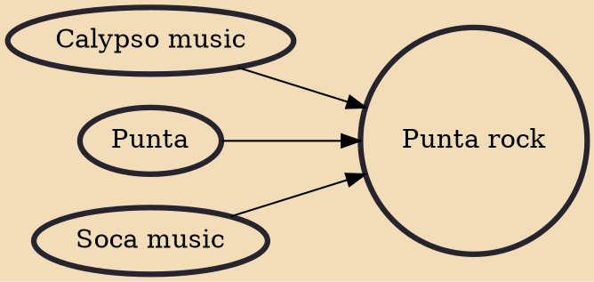

Punta rock, or Belizean punta, is a form of Garifuna music originating in Belize and created by Pen Cayetano. Songs are usually sung in Belizean Kriol or Garifuna and rarely in Spanish or English. Many Garifuna American singers perform the genre as well.

## Influences

- [[Calypso music]]
- [[Punta]]
- [[Soca music]]
