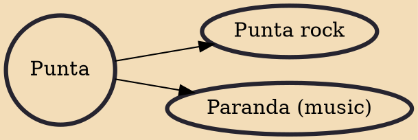

Punta is an Afro-indigenous dance and cultural music originating in the Caribbean Island of Saint Vincent And The Grenadines by the Garifuna people before being exiled from the island. Which is also known as Yurumei. It has African and Arawak elements which are also the characteristics of the Garifuna language.Punta is the best-known traditional dance belonging to the Garifuna community. It is also known as banguity or bunda, before the first arrival of the Garifuna people in Punta Gorda, Roatan, Honduras on April 12, 1797.

## Derivatives
- [[Punta rock]]
- [[Paranda (music)]]
