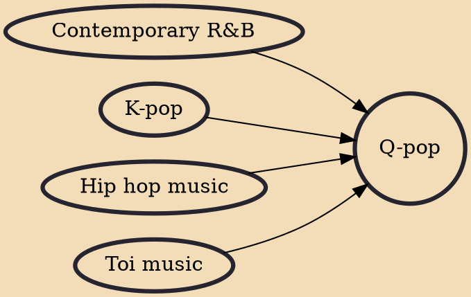

Q-pop or Qazaq pop is a music genre originating in Kazakhstan. It is a modern form of Kazakhstani pop music sung in Kazakh, incorporating elements of Western pop music, , EDM, R&B and Toi-pop, with heavy influences from K-pop of South Korea. The genre first surfaced in 2015 when the first Q-pop group, Ninety One debuted. Since then the genre has experienced growing popularity among Kazakhstani youths, with more Q-pop artists forming and debuting.

## Influences

- [[Contemporary R&B]]
- [[K-pop]]
- [[Hip hop music]]
- [[Toi music]]
