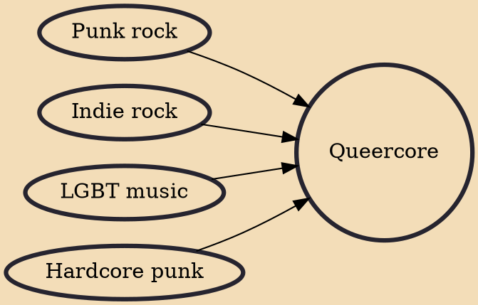

Queercore (or homocore) is a cultural/social movement that began in the mid-1980s as an offshoot of the punk subculture and a music genre that comes from punk rock. It is distinguished by its discontent with society in general, and specifically society's disapproval of the LGBT community. Queercore expresses itself in a DIY style through magazines, music, writing and film.

## Influences
- [[Punk rock]]
- [[Indie rock]]
- [[LGBT music]]
- [[Hardcore punk]]
