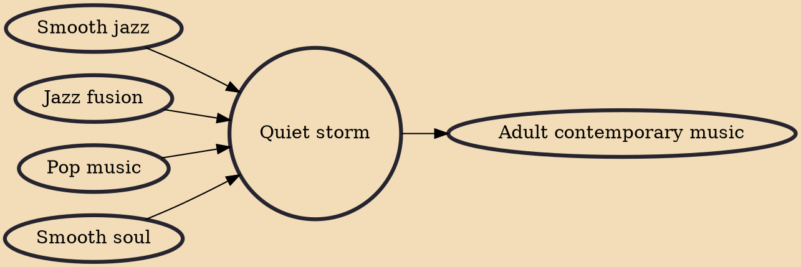

Quiet storm is a radio format and genre of R&B, performed in a smooth, romantic, jazz-influenced style. It was named after the title song on Smokey Robinson's 1975 album A Quiet Storm. The radio format was pioneered in 1976 by Melvin Lindsey, while he was an intern at the Washington, D.C. radio station WHUR-FM. It eventually became regarded as an identifiable subgenre of R&B. Quiet storm was marketed to upscale mature African-American audiences during the 1980s, while falling out of favor with young listeners in the age of hip hop.

## Influences
- [[Smooth jazz]]
- [[Jazz fusion]]
- [[Pop music]]
- [[Smooth soul]]

## Derivatives
- [[Adult contemporary music]]
