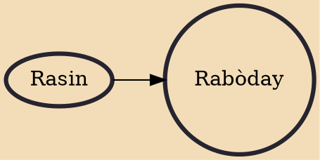

```dot
digraph {
	graph [bgcolor="#F3DDB8" rankdir=LR]
	node [color="#26242F" penwidth=3.0]
	"Rabòday" [shape=circle]
	Rasin [URL="/rasin/"]
	Rasin -> "Rabòday"
}
```

Rabòday is a rhythm of traditional dance music played to the drum and is arranged to electronic music.

## Influences
- [[Rasin]]
