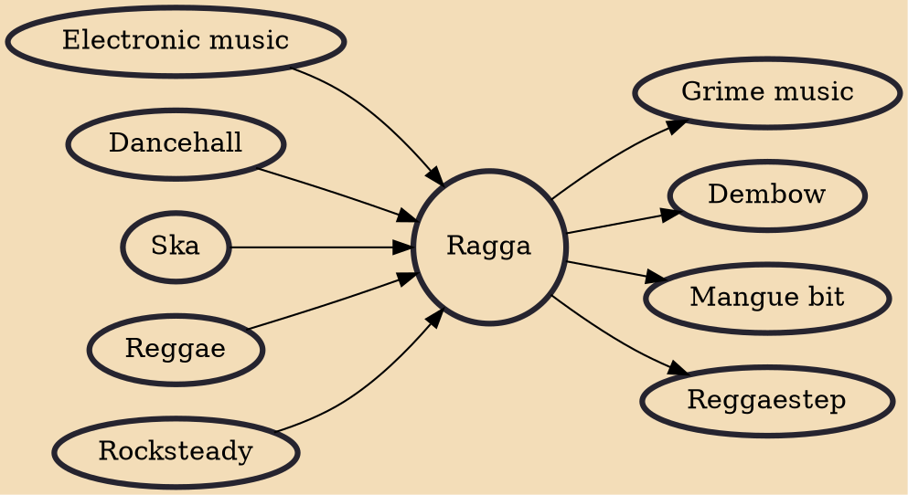

Raggamuffin music, usually abbreviated as ragga, is a subgenre of dancehall and reggae music. The instrumentals primarily consist of electronic music. Similar to hip hop, sampling often serves a prominent role in raggamuffin music. Wayne Smith's "Under Mi Sleng Teng", produced by King Jammy in 1985 on a Casio MT-40 synthesizer, is generally recognized as the seminal ragga song. "Sleng Teng" boosted Jammy's popularity immensely, and other producers quickly released their own versions of the riddim, accompanied by dozens of different vocalists.

## Influences

- [[Electronic music]]
- [[Dancehall]]
- [[Ska]]
- [[Reggae]]
- [[Rocksteady]]

## Derivatives

- [[Grime music]]
- [[Dembow]]
- [[Mangue bit]]
- [[Reggaestep]]
