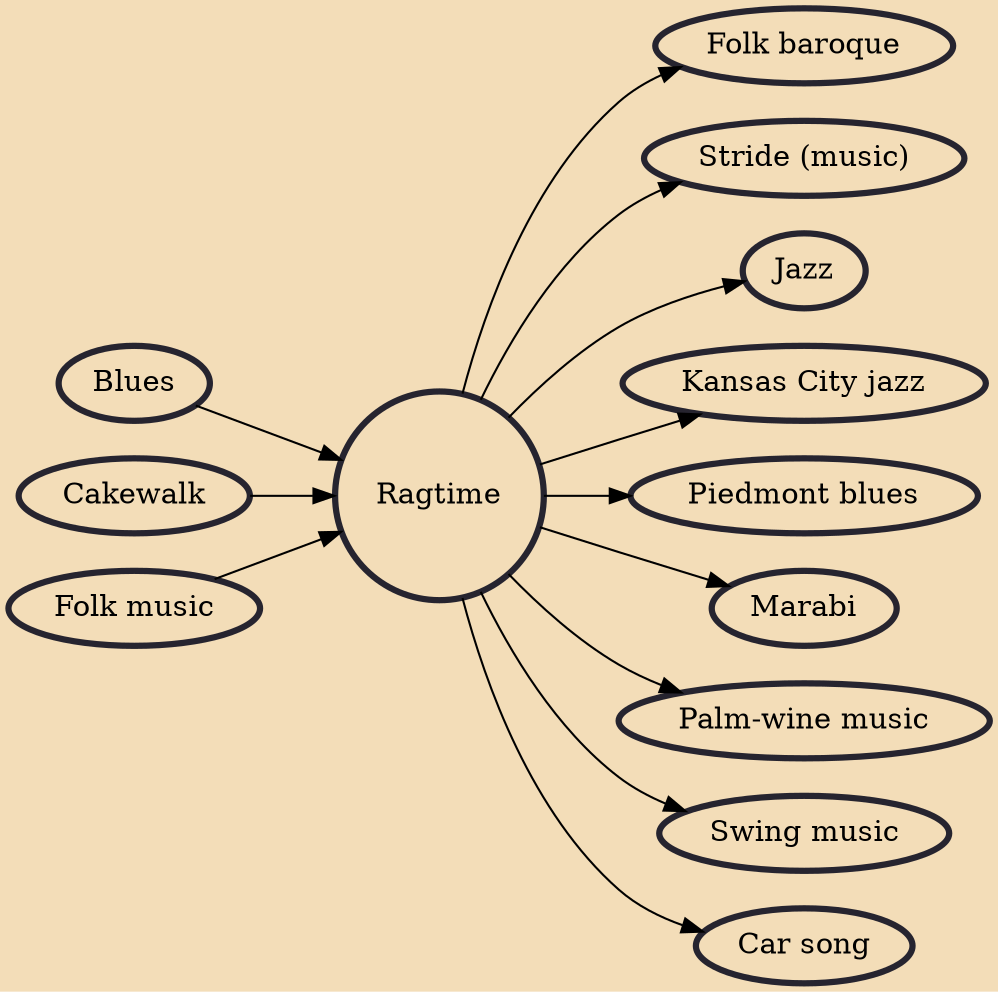

Ragtime – also spelled rag-time or rag time – is a musical style that flourished from the 1890s to 1910s. Its cardinal trait is its syncopated or "ragged" rhythm. Ragtime was popularized during the early 20th century by composers such as Scott Joplin, James Scott and Joseph Lamb. Ragtime pieces (often called "rags") are typically composed for and performed on piano, though the genre has been adapted for a variety of instruments and styles. "Maple Leaf Rag", "The Entertainer", "Fig Leaf Rag", "Frog Legs Rag", and "Sensation Rag" are among the most popular songs of the genre.

## Influences
- [[Blues]]
- [[Cakewalk]]
- [[Folk music]]

## Derivatives
- [[Folk baroque]]
- [[Stride (music)]]
- [[Jazz]]
- [[Kansas City jazz]]
- [[Piedmont blues]]
- [[Marabi]]
- [[Palm-wine music]]
- [[Swing music]]
- [[Car song]]
