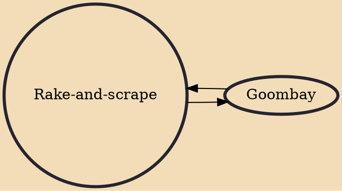

Rake-and-scrape is the traditional music of The Bahamas, alongside Junkanoo. It combines African musical elements with European musical elements to create a sound comparable to other Caribbean music while remaining distinct.

## Influences
- [[Goombay]]

## Derivatives
- [[Goombay]]
