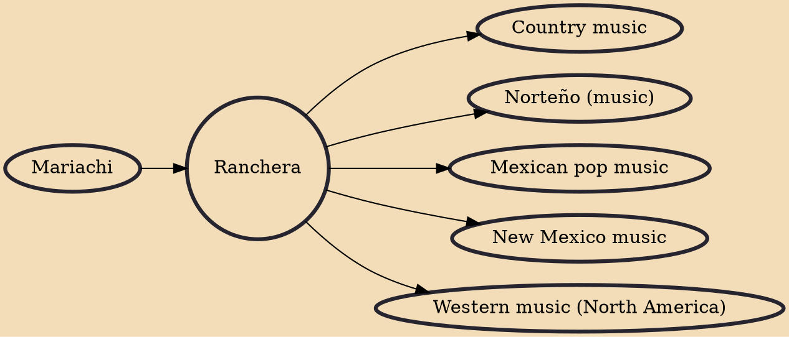

Ranchera (pronounced [ranˈtʃeɾa]) or canción ranchera is a genre of traditional music of Mexico. It dates to before the years of the Mexican Revolution. Rancheras today are played in virtually all regional Mexican music styles. Drawing on rural traditional folk music, the ranchera developed as a symbol of a new national consciousness in reaction to the aristocratic tastes of the period. The classic "rancheras" songs usually talk about life in Mexico not only in rural areas, but also portray life in Mexico at the time of the bandits.

## Influences
- [[Mariachi]]

## Derivatives
- [[Country music]]
- [[Norteño (music)]]
- [[Mexican pop music]]
- [[New Mexico music]]
- [[Western music (North America)]]
