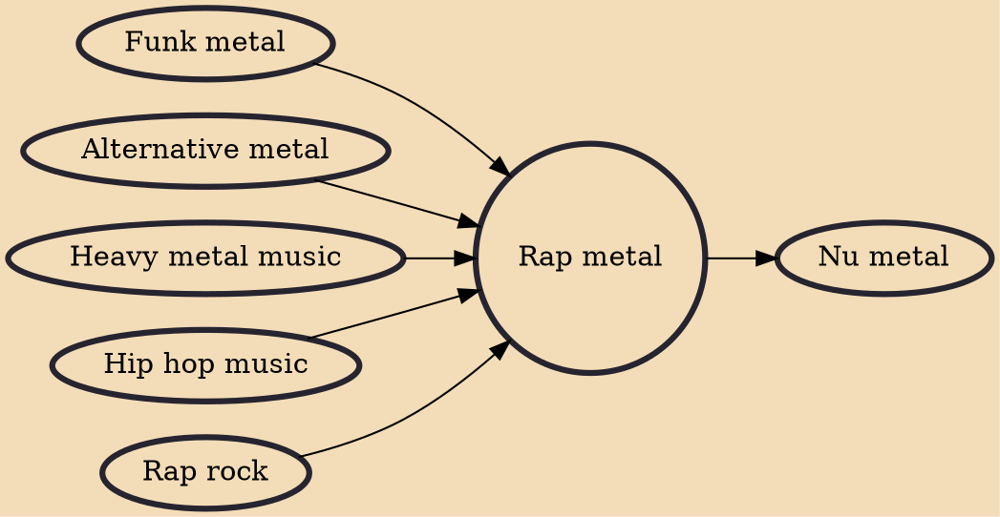

Rap metal is a subgenre of rap rock and alternative metal music which combines hip hop with heavy metal. It usually consists of heavy metal guitar riffs, funk metal elements, rapped vocals and sometimes turntables.

## Influences
- [[Funk metal]]
- [[Alternative metal]]
- [[Heavy metal music]]
- [[Hip hop music]]
- [[Rap rock]]

## Derivatives
- [[Nu metal]]
