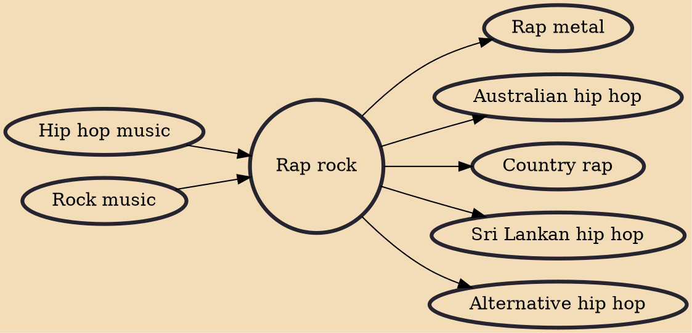

Rap rock is a fusion genre that fuses vocal and instrumental elements of hip hop with various forms of rock. Rap rock's most popular subgenres include rap metal and , which include heavy metal and hardcore punk-oriented influences, respectively.

## Influences

- [[Hip hop music]]
- [[Rock music]]

## Derivatives

- [[Rap metal]]
- [[Australian hip hop]]
- [[Country rap]]
- [[Sri Lankan hip hop]]
- [[Alternative hip hop]]
