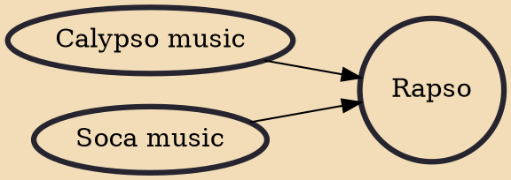

Rapso is a form of Trinidadian music that grew out of the social unrest of the 1970s. Black Power and unions grew in the 1970s, and rapso grew along with them. The first recording was Blow Away by Lancelot Layne in 1970. Six years later, Cheryl Byron (founder of the New York City based Something Positive Dance Company) was scorned when she sang rapso at a calypso tent; she is now called the "Mother of Rapso".

## Influences
- [[Calypso music]]
- [[Soca music]]
